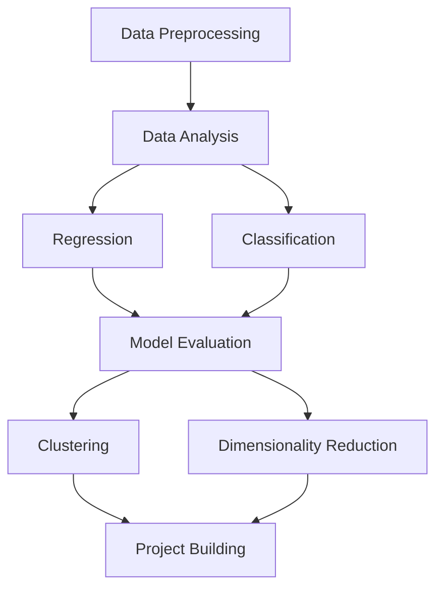

# Machine Learning Notebook Hub

<p align="center">
  
</p>

<p align="center">
  
  
  
  
  
</p>

<p align="center">
  <b>A structured, visual, and beginner-friendly machine learning notebook repository built to help students understand concepts, practice implementation, and build a strong foundation in ML.</b>
</p>

---

## Table of Contents

- [About the Project](#about-the-project)
- [Why This Repository Matters](#why-this-repository-matters)
- [What You Will Learn](#what-you-will-learn)
- [Who This Repository Is For](#who-this-repository-is-for)
- [Learning Roadmap](#learning-roadmap)
- [Repository Highlights](#repository-highlights)
- [Repository Structure](#repository-structure)
- [Notebook Index](#notebook-index)
- [Visual Concept Gallery](#visual-concept-gallery)
- [Datasets](#datasets)
- [Tech Stack](#tech-stack)
- [How to Run](#how-to-run)
- [Recommended Study Order](#recommended-study-order)
- [Skills You Will Build](#skills-you-will-build)
- [Project Goals](#project-goals)
- [Future Improvements](#future-improvements)
- [Contributing](#contributing)
- [License](#license)
- [Author](#author)

---

## About the Project

**Machine Learning Notebook Hub** is a curated collection of Jupyter notebooks designed to make machine learning easier to understand through step-by-step examples.

Instead of being just a folder full of notebooks, this repository is structured like a **learning system**.

It is built for:
- understanding theory
- seeing implementation in code
- learning how data flows through an ML pipeline
- practicing real concepts used in machine learning projects

Each notebook focuses on a specific concept or algorithm and is designed to be:
- simple to run
- easy to read
- reusable for study and projects
- useful for academic presentation and portfolio building

---

## Why This Repository Matters

Many machine learning repositories suffer from one or more of these problems:

- no clear structure
- no explanation of purpose
- random notebooks with no learning path
- no visuals
- no beginner guidance
- difficult to present academically

This repository is built differently.

It tries to answer these questions for the reader immediately:

- What is this project about?
- Why does it exist?
- What will I learn here?
- Which notebook should I open first?
- How are the topics connected?
- How can I use this as a student project or portfolio piece?

That is what makes a repository feel complete and human.

---

## What You Will Learn

This repository helps you understand the machine learning workflow from basic preprocessing to model building and evaluation.

### Core learning areas:
- Data preprocessing
- Exploratory data analysis
- Regression algorithms
- Classification algorithms
- Model evaluation
- Clustering
- Dimensionality reduction

### Concepts covered:
- Feature scaling
- Encoding categorical variables
- Linear regression
- Multiple linear regression
- Polynomial regression
- Logistic regression
- K-Nearest Neighbors
- Decision trees
- Support Vector Machines
- Cross-validation
- Confusion matrix
- K-Means clustering
- Principal Component Analysis

---

## Who This Repository Is For

This project is suitable for:

### Students
If you are studying machine learning, data science, AI, or computer science and want readable examples for practice or academic submission.

### Beginners
If you are new to ML and want a guided notebook collection instead of scattered tutorials.

### Intermediate Learners
If you already know some basics and want a revision hub with neat examples.

### Portfolio Builders
If you want a GitHub project that looks presentable and shows your progress clearly.

---

## Learning Roadmap



This is the intended learning flow of the repository.

You begin by understanding data, then build models, then evaluate them, and finally move into unsupervised learning and dimensionality reduction.

---

## Repository Highlights

- Structured for learning, not just storage
- Professor-friendly presentation
- Clear notebook categorization
- Beginner-readable documentation
- Ready for GitHub portfolio showcase
- Expandable for future ML topics
- Includes separate dataset guidance
- Can serve as a mini academic learning hub

---

## Repository Structure

```
ml-notebook-hub/
│
├── datasets/
│   └── README.md
│
├── CODE_OF_CONDUCT.md
├── CONTRIBUTING.md
├── LICENSE
├── README.md
├── banner.png
│
├── data_preprocessing.ipynb
├── data_analysis.ipynb
├── simple_linear_regression.ipynb
├── multiple_linear_regression.ipynb
├── polynomial_regression.ipynb
├── simple_logistic_regression.ipynb
├── knn_classification.ipynb
├── decision_tree_classification.ipynb
├── svm_classification.ipynb
├── cross_validation_example.ipynb
├── confusion_matrix_example.ipynb
├── k_means_clustering.ipynb
├── pca_example.ipynb
│
└── requirements.txt
```

---

## Notebook Index

### 1. Foundations

#### `data_preprocessing.ipynb`
Introduces data cleaning and feature preparation.  
Topics:
- handling structured data
- scaling
- encoding
- preparing features for ML algorithms

#### `data_analysis.ipynb`
Focuses on understanding data before modeling.  
Topics:
- descriptive statistics
- feature distributions
- basic visual exploration

---

### 2. Regression

#### `simple_linear_regression.ipynb`
Demonstrates prediction using a single input feature.

#### `multiple_linear_regression.ipynb`
Extends linear regression to multiple features and shows how several variables influence prediction.

#### `polynomial_regression.ipynb`
Shows how non-linear relationships can be modeled by transforming features.

---

### 3. Classification

#### `simple_logistic_regression.ipynb`
Introduces binary classification and probability-based prediction.

#### `knn_classification.ipynb`
Demonstrates instance-based learning using nearest data points.

#### `decision_tree_classification.ipynb`
Shows how hierarchical splits are used to classify data.

#### `svm_classification.ipynb`
Introduces support vector machines and margin-based classification.

---

### 4. Model Evaluation

#### `cross_validation_example.ipynb`
Shows how to evaluate a model more reliably using folds rather than a single split.

#### `confusion_matrix_example.ipynb`
Explains classification performance using:
- confusion matrix
- accuracy
- precision
- recall
- F1-score

---

### 5. Unsupervised Learning

#### `k_means_clustering.ipynb`
Demonstrates grouping unlabeled data into clusters.

#### `pca_example.ipynb`
Shows how dimensionality can be reduced while preserving meaningful variance.

---

## Visual Concept Gallery

These images help a new learner connect the notebooks to actual ML concepts.

### Linear Regression
<p align="center">
  
</p>

### Logistic Function
<p align="center">
  
</p>

### K-Means Clustering
<p align="center">
  
</p>

### PCA
<p align="center">
  
</p>

### SVM Concept
<p align="center">
  
</p>

---

## Datasets

This repository may use small datasets directly or reference standard educational datasets.

The `datasets/README.md` file explains:
- what datasets are used
- where they come from
- how they should be added or documented

Recommended practice:
- keep datasets organized
- document sources clearly
- avoid uploading sensitive or copyrighted data

---

## Tech Stack

This repository primarily uses:

- **Python**
- **Jupyter Notebook**
- **NumPy**
- **Pandas**
- **Matplotlib**
- **Seaborn**
- **Scikit-learn**

---

## How to Run

### 1. Clone the repository

```bash
git clone https://github.com/Nikhilpreetsaini/ml-notebook-hub.git
cd ml-notebook-hub
```

### 2. Install dependencies

```bash
pip install -r requirements.txt
```

### 3. Launch Jupyter

```bash
jupyter notebook
```

### 4. Open any notebook

Start with:
- `data_preprocessing.ipynb`
- `data_analysis.ipynb`
- then move to regression and classification notebooks

---

## Recommended Study Order

For the best learning experience, follow this order:

1. `data_preprocessing.ipynb`
2. `data_analysis.ipynb`
3. `simple_linear_regression.ipynb`
4. `multiple_linear_regression.ipynb`
5. `polynomial_regression.ipynb`
6. `simple_logistic_regression.ipynb`
7. `knn_classification.ipynb`
8. `decision_tree_classification.ipynb`
9. `svm_classification.ipynb`
10. `cross_validation_example.ipynb`
11. `confusion_matrix_example.ipynb`
12. `k_means_clustering.ipynb`
13. `pca_example.ipynb`

---

## Skills You Will Build

By studying and extending this repository, you will improve your ability to:

- understand data before modeling
- choose suitable algorithms
- implement models in Python
- evaluate prediction quality
- visualize ML concepts
- structure a GitHub ML project professionally
- explain ML workflows academically

---

## Project Goals

This repository is meant to become more than a notebook collection.

### Short-term goals
- make ML notebooks clean and readable
- improve explanation quality
- build a strong academic GitHub project

### Long-term goals
- expand into deep learning
- add end-to-end mini projects
- include feature engineering examples
- add model comparison notebooks
- make the repository a complete beginner ML roadmap

---

## Future Improvements

Planned and possible additions:

- Random Forest notebooks
- Naive Bayes notebook
- Gradient Descent visualization
- ROC Curve and AUC notebook
- Feature selection techniques
- Hyperparameter tuning notebook
- Hierarchical clustering
- DBSCAN clustering
- Mini capstone ML project
- Real dataset case studies
- Better notebook thumbnails/screenshots
- Custom diagrams inside `assets/`

---

## Contributing

Contributions are welcome.

You can help by:
- improving notebook explanations
- adding new ML algorithms
- cleaning notebook structure
- expanding visualizations
- documenting datasets better

Please read:
- `CONTRIBUTING.md`
- `CODE_OF_CONDUCT.md`

before contributing.

---

## License

This project is licensed under the **MIT License**.  
See the `LICENSE` file for full details.

---

## Author

**Nikhil Preet Saini**

This repository is part of an ongoing effort to build a strong, readable, and visually meaningful machine learning project portfolio.

If you are viewing this repository as a professor, recruiter, or collaborator, this project reflects both technical practice and an effort to present machine learning content in a structured, learner-friendly way.
