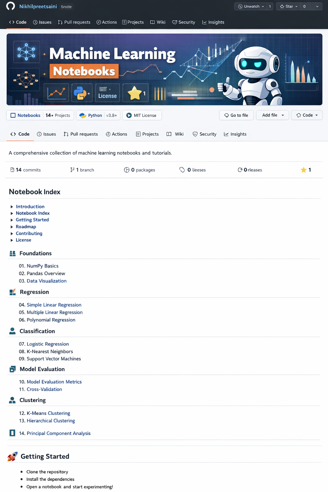

# Machine Learning Notebook Hub



## Overview

This repository is a curated collection of Jupyter notebooks designed to help students and practitioners learn and experiment with core machine‑learning concepts.  Each notebook walks through a specific technique with clean code, comments and plots.  The goal is to provide a gentle progression from basic data handling through regression, classification and model evaluation.  Feel free to follow along, tweak the examples and build on top of them.

## Contents

The notebooks are grouped by topic.  Use the numbered list below to navigate.  The numbering does **not** imply strict order—you can jump around based on your interests.

### Foundations

1. **Data Preprocessing** – preparing data for modeling: handling missing values, encoding categorical features, scaling and normalizing.
2. **Data Analysis & Visualisation** – exploring datasets using descriptive statistics, Pandas and Matplotlib/Seaborn plots.

### Regression

3. **Simple Linear Regression** – fitting a straight line to one feature, interpreting slope/intercept, residuals and goodness‑of‑fit.
4. **Multiple Linear Regression** – extending linear regression to multiple features and evaluating performance.
5. **Polynomial Regression** – modeling non‑linear relationships by adding polynomial terms to the linear model.

### Classification

6. **Simple Logistic Regression** – modeling binary outcomes using the logistic function; interpreting probabilities and decision boundaries.
7. **K‑Nearest Neighbours (KNN)** – non‑parametric classification based on similarity in feature space.
8. **Decision Tree Classification** – building a tree‑based model that splits data on informative features.
9. **Support Vector Machine (SVM) Classification** – training a kernel‑based classifier that finds optimal separating hyperplanes.

### Model Evaluation

10. **Cross‑Validation Example** – using train/test splits and k‑fold cross validation to evaluate generalisation error.
11. **Confusion Matrix Example** – computing and visualising confusion matrices and classification metrics for multi‑class problems.

### Unsupervised Learning & Dimensionality Reduction

12. **K‑Means Clustering Example** – grouping similar observations without labels using the K‑means algorithm and visualising cluster centroids.
13. **PCA Example** – reducing high‑dimensional data to two principal components using Principal Component Analysis and visualising the result.


Each notebook lives at the root of this repository and can be opened directly in JupyterLab, Jupyter Notebook, Google Colab or VS Code.  If a notebook depends on an external dataset you will find instructions in the notebook’s first cell or in the `datasets/README.md` file.

## Getting Started

1. **Clone or download** this repository to your machine.
2. Install the required Python packages (see `requirements.txt`):

   ```bash
   pip install -r requirements.txt
   ```

3. Launch Jupyter and open any notebook.  For example:

   ```bash
   jupyter notebook data_preprocessing.ipynb
   ```

4. Run each cell sequentially and experiment with different parameters and datasets.

## Roadmap

This project is actively maintained as a learning resource.  Now that the repository covers foundations, regression, classification (including SVM), model evaluation, unsupervised learning and dimensionality reduction, future additions may include:

* notebooks on regularisation (ridge, lasso and elastic net)
* ensemble methods such as random forests, gradient boosting and bagging
* model interpretability techniques (SHAP, LIME) and fairness metrics
* additional clustering algorithms (hierarchical clustering, DBSCAN) and anomaly detection

Feel free to suggest topics by opening an issue or contributing a notebook!

## Contributing

We welcome contributions of all kinds—bug fixes, new notebooks, improved explanations and translations.  Please read the [Contributing Guidelines](CONTRIBUTING.md) before submitting a pull request.

## License

This project is licensed under the [MIT License](LICENSE).  See the license file for details.

## Acknowledgements

This repository was inspired by the structure and thoroughness of other open machine‑learning guides.  Although our notebooks were developed independently from scratch, the organisation and presentation draw upon best practices across the community.