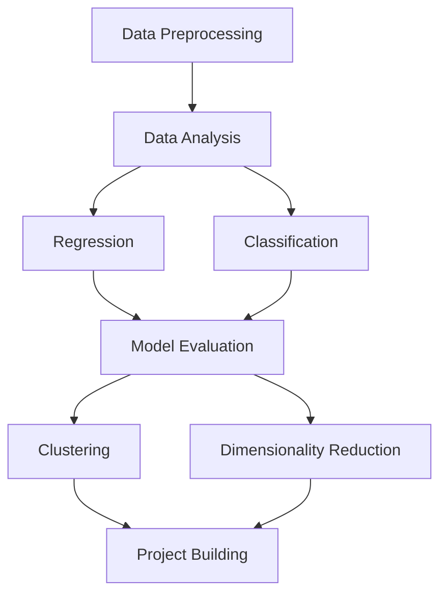

# Machine Learning Notebook Hub

<p align="center">
  
</p>

<p align="center">
  
  
  
  
  
</p>

<p align="center">
  <b>A structured, visual, and beginner-friendly machine learning notebook repository built to help students understand concepts, practice implementation, and build a strong foundation in ML.</b>
</p>

## Table of Contents

- [About the Project](#about-the-project)
- [Why This Repository Matters](#why-this-repository-matters)
- [What You Will Learn](#what-you-will-learn)
- [Who This Repository Is For](#who-this-repository-is-for)
- [Learning Roadmap](#learning-roadmap)
- [Repository Highlights](#repository-highlights)
- [Repository Structure](#repository-structure)
- [Notebook Index](#notebook-index)
- [Visual Concept Gallery](#visual-concept-gallery)
- [Datasets](#datasets)
- [Tech Stack](#tech-stack)
- [How to Run](#how-to-run)
- [Recommended Study Order](#recommended-study-order)
- [Skills You Will Build](#skills-you-will-build)
- [Project Goals](#project-goals)
- [Future Improvements](#future-improvements)
- [Contributing](#contributing)
- [License](#license)
- [Author](#author)

## About the Project

Machine Learning Notebook Hub is a curated collection of Jupyter notebooks designed to make machine learning easier to understand through step-by-step examples. Each notebook focuses on a specific concept or algorithm and pairs clear explanations with code you can run immediately.

## Why This Repository Matters

Many ML repositories provide code without context. This project is structured differently – it emphasises learning, with clean progression from data preprocessing to modeling and evaluation. You’ll always know why a concept matters, how it works, and where to go next.

## What You Will Learn

**Core areas:**

- Data preprocessing and exploration
- Regression algorithms (linear, multiple, polynomial)
- Classification algorithms (logistic, K-NN, decision trees, SVM)
- Model evaluation (cross-validation, confusion matrix)
- Unsupervised learning (K-means clustering)
- Dimensionality reduction (PCA)

**Concepts:**

- Feature scaling and encoding
- Loss functions and optimization
- Bias–variance trade-off
- Overfitting vs underfitting
- Interpreting model performance metrics

## Who This Repository Is For

- **Students:** Need clean examples for coursework or internships.
- **Beginners:** Looking for a guided learning path.
- **Practitioners:** Want quick reference patterns for real projects.
- **Portfolio builders:** Seeking a polished project to showcase their ML skills.

## Learning Roadmap



This roadmap guides your journey – start with understanding your data, then build models, evaluate them, and explore unsupervised methods.

## Repository Highlights

- **Structured learning flow** from foundations to unsupervised learning.
- **Clean explanations** written with beginners in mind.
- **Ready for presentations** with visuals and diagrams included.
- **Future extensibility** – add new notebooks as you learn more.

## Repository Structure

```
ml-notebook-hub/
├── datasets/
│   └── README.md
├── CODE_OF_CONDUCT.md
├── CONTRIBUTING.md
├── LICENSE
├── README.md
├── banner.png
├── data_preprocessing.ipynb
├── data_analysis.ipynb
├── simple_linear_regression.ipynb
├── multiple_linear_regression.ipynb
├── polynomial_regression.ipynb
├── simple_logistic_regression.ipynb
├── knn_classification.ipynb
├── decision_tree_classification.ipynb
├── svm_classification.ipynb
├── cross_validation_example.ipynb
├── confusion_matrix_example.ipynb
├── k_means_clustering.ipynb
├── pca_example.ipynb
├── NOTEBOOK_GUIDE.md
└── PROJECT_VISION.md
```

## Notebook Index

### Foundations

#### **data_preprocessing.ipynb**

Learn how to handle missing values, encode categorical variables, and scale features.

#### **data_analysis.ipynb**

Perform exploratory data analysis to understand patterns and correlations.

### Regression

#### **simple_linear_regression.ipynb**

Fit a line to data with one input variable.

#### **multiple_linear_regression.ipynb**

Extend regression to multiple features and interpret coefficients.

#### **polynomial_regression.ipynb**

Model non-linear relationships through polynomial terms.

### Classification

#### **simple_logistic_regression.ipynb**

Classify binary outcomes by modeling probabilities.

#### **knn_classification.ipynb**

Predict labels based on nearest neighbors.

#### **decision_tree_classification.ipynb**

Use a tree structure to split the data and classify.

#### **svm_classification.ipynb**

Separate classes using support vector machines and hyperplanes.

### Model Evaluation

#### **cross_validation_example.ipynb**

Use k-fold cross-validation to improve generalization.

#### **confusion_matrix_example.ipynb**

Calculate precision, recall, and F1-score using a confusion matrix.

### Unsupervised Learning & Dimensionality Reduction

#### **k_means_clustering.ipynb**

Cluster unlabeled data points using the K-means algorithm.

#### **pca_example.ipynb**

Reduce dimensionality while preserving variance through PCA.

## Visual Concept Gallery

### Linear Regression


### Logistic Function


### K-Means Clustering


### Principal Component Analysis (PCA)


### Support Vector Machine (SVM)


### Confusion Matrix


*Images courtesy of Wikimedia Commons (CC BY-SA and CC BY licenses).* 

## Datasets

The `datasets/README.md` file explains where datasets come from and how to load them. Always document your sources and respect licenses when adding data.

## Tech Stack

- Python 3.9+
- Jupyter Notebook
- NumPy
- Pandas
- Matplotlib
- Seaborn
- Scikit-learn

## How to Run

Clone this repository and install dependencies:

```bash
git clone https://github.com/Nikhilpreetsaini/ml-notebook-hub.git
cd ml-notebook-hub
pip install -r requirements.txt
jupyter notebook
```

Open any notebook and run all cells to see outputs. The notebooks are self-contained.

## Recommended Study Order

1. `data_preprocessing.ipynb`
2. `data_analysis.ipynb`
3. `simple_linear_regression.ipynb`
4. `multiple_linear_regression.ipynb`
5. `polynomial_regression.ipynb`
6. `simple_logistic_regression.ipynb`
7. `knn_classification.ipynb`
8. `decision_tree_classification.ipynb`
9. `svm_classification.ipynb`
10. `cross_validation_example.ipynb`
11. `confusion_matrix_example.ipynb`
12. `k_means_clustering.ipynb`
13. `pca_example.ipynb`

## Skills You Will Build

By completing this repository you will:

- Understand the machine learning workflow
- Preprocess and analyse data effectively
- Implement basic regression and classification algorithms
- Evaluate models with proper metrics
- Explore unsupervised learning and dimensionality reduction
- Present a professional GitHub project

## Project Goals

**Short term:**

- Improve the explanations and visuals
- Add more classification and regression examples
- Provide practice exercises

**Long term:**

- Expand to deep learning with Keras/PyTorch
- Add ensemble methods (Random Forest, Gradient Boosting)
- Include real-world datasets and mini-projects

## Future Improvements

We plan to add:

- Random Forest, Gradient Boosting, Naive Bayes
- Hyperparameter tuning examples
- ROC curve and AUC notebooks
- Advanced clustering methods (DBSCAN, Hierarchical)
- Hands-on mini projects

Contributions to these features are welcome.

## Contributing

We welcome contributions! Please read `CONTRIBUTING.md` and `CODE_OF_CONDUCT.md` before submitting pull requests. Follow the learning structure and keep notebooks clean and well-commented.

## License

This project is licensed under the MIT License. See `LICENSE` for details.

## Author

**Nikhil Preet Saini** — passionate about making machine learning accessible and structured.
